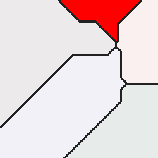
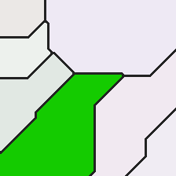
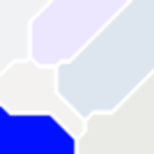
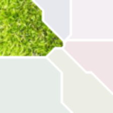

# Voronoy Cell Toy Data Generator
This is some code which has been written to illustrate an idea in some XAI research context.
The idea is to draw some simple images with ground truth masks for localization testing.
Voronoy regions seem like a simple enough yet at the same time interesting enough idea.
The provided implementations draws parameterizable images of colored regions and produces ground truth labels for region counts, each samples true class, and a binary mask for the true class.

## Requirements
This tool has been developed with Python 3.8 and the following packages:
```
tqdm==4.56.0
imageio==2.9.0
numpy==1.20.1
matplotlib==3.3.4
scipy==1.6.0
scikit-learn==0.24.1
```
Required packages can be installed via `pip install -r requirements.txt`

## How to Use
```
usage: main.py [-h] [--random_seed RANDOM_SEED] [--size SIZE] [--number NUMBER] [--min_centroids MIN_CENTROIDS] [--max_centroids MAX_CENTROIDS]
               [--distance_metric DISTANCE_METRIC] [--class_colors [CLASS_COLORS [CLASS_COLORS ...]]] [--class_color_deviation CLASS_COLOR_DEVIATION]
               [--bg_colors [BG_COLORS [BG_COLORS ...]]] [--bg_color_deviation BG_COLOR_DEVIATION] [--draw_markers] [--marker_color MARKER_COLOR] [--draw_lines]
               [--line_color LINE_COLOR] [--line_dilation_iterations LINE_DILATION_ITERATIONS] [--line_erosion_iterations LINE_EROSION_ITERATIONS] [--show]
               [--output OUTPUT]

Generate some toy images of colored voronoy cells. Produces ground truth class labels, ground truth true class region masks and region count labels. Also outputs its
parameterization for reproducibility.

optional arguments:
  -h, --help            show this help message and exit
  --random_seed RANDOM_SEED, -rs RANDOM_SEED
                        random seed for random number generation. int or hex code.
  --size SIZE, -s SIZE  canvas size for the images to be generated. we are assuming square images and are working in pixel coordinates.
  --number NUMBER, -n NUMBER
                        number of samples to be generated.
  --min_centroids MIN_CENTROIDS, -mnc MIN_CENTROIDS
                        minimum number of centroids to be scattered on the canvas.
  --max_centroids MAX_CENTROIDS, -mxc MAX_CENTROIDS
                        maximum number of centroids to be scattered on the canvas.
  --distance_metric DISTANCE_METRIC, -d DISTANCE_METRIC
                        the distance measure to use for knn. supports naming choices compatible for sklearn.neighbors.DistanceMetric.
  --class_colors [CLASS_COLORS [CLASS_COLORS ...]], -cc [CLASS_COLORS [CLASS_COLORS ...]]
                        the colors for labelled classes as rgb hex strings. multiple namings possible. each color adds a class.
  --class_color_deviation CLASS_COLOR_DEVIATION, -ccd CLASS_COLOR_DEVIATION
                        the standard deviation (in rgb color steps) for possible deviations in class color.
  --bg_colors [BG_COLORS [BG_COLORS ...]], -bc [BG_COLORS [BG_COLORS ...]]
                        the colors for "background" tiles. each added color adds to the variation.
  --bg_color_deviation BG_COLOR_DEVIATION, -bcd BG_COLOR_DEVIATION
                        the standard deviation (in rgb color steps) for possible deviations in background color.
  --draw_markers, -dm   set to draw (single pixel) markers for centroids.
  --marker_color MARKER_COLOR, -mc MARKER_COLOR
                        the color of centroid markers. "class" is a darker version of the class color. otherwise, rgb hex codes specify special color choices, e.g. 0x000000
                        is black.
  --draw_lines, -dl     draw dividing lines between regions?
  --line_color LINE_COLOR, -lc LINE_COLOR
                        color of lines dividing voronoy cells.
  --line_dilation_iterations LINE_DILATION_ITERATIONS, -ldi LINE_DILATION_ITERATIONS
                        how often to binary dilate region boundaries? dilation is applied before erosion.
  --line_erosion_iterations LINE_EROSION_ITERATIONS, -lei LINE_EROSION_ITERATIONS
                        how often to binary erode region boundaries? erosion is applied after dilation.
  --show                show generated images?
  --output OUTPUT, -o OUTPUT
                        output directory for outputting data and labels.
```

## Example Data
The following call
```
python main.py --random_seed 0xc0ffee  --size 224  --number 6  --min_centroids 5  --max_centroids 10  --distance_metric chebyshev  --class_colors 0xff0000 0x00ff00 0x0000ff  --class_color_deviation 40  --bg_colors 0xeeeeee  --bg_color_deviation 5  --marker_color class  --draw_lines   --line_color 0x222222  --line_dilation_iterations 1  --line_erosion_iterations 1  --show   --output ./output_224
```
will generate some data containing 6 images of size 244x244 with 5 to 10 centroids each which are placed according to a random process initialized with the random seed `0xc0ffee`.
The data will consist of three different classes, identified by the given class colors `0xff0000`, `0x00ff00`, `0x0000ff`, of which the color value (within a range of [0,255] per rgb color channel) might deviate with a standard deviation of 40 per class region.
One region will be picked at random to be the class region, while the others will be considered as background and colored with `0xeeeeee` +- some standard deviation of 5.
The specification of the marker color as "class" would draw the centroid location in a slightly darker hue than the region color, but has no effect here, since `--draw_markers` has not been set. Due to the setting of `--draw_lines` lines will be drawn with a line color of `0x222222`. After finding the edges between voronoy regions using a sobel operator, line pixels are post processed with one iteration each of binary dilation and erosion (where dilation iterations are always applied before erosion iterations).
`--show` specifies that each generated sample is shown to the user. Generated data is then written to the specified output location, which contains the generated images, with one corresponding ground truth localization mask each, a file `labels.txt` containing the class labels and number of regions per sample, and a file `args.txt` ensuring repeatability of the function call.

The following images, with ground truth masks below, have been generated:

  

  

  

  

The content of `labels.txt`, describing one sample per line, is

```
# image_id true_class num_regions
0 1 9
1 0 5
2 1 7
3 2 6
4 0 5
5 2 6

```

The final file generated by the script is `args.txt`, containing the complete configuration leading to the generation of above data:
```
--random_seed 0xc0ffee  --size 224  --number 6  --min_centroids 5  --max_centroids 10  --distance_metric chebyshev  --class_colors 0xff0000 0x00ff00 0x0000ff  --class_color_deviation 40  --bg_colors 0xeeeeee  --bg_color_deviation 5  --marker_color class  --draw_lines   --line_color 0x222222  --line_dilation_iterations 1  --line_erosion_iterations 1  --show   --output ./output_224
```

This allows for a replication of the previous results by simply calling
```
python main.py $(cat output_224/args.txt)
```
